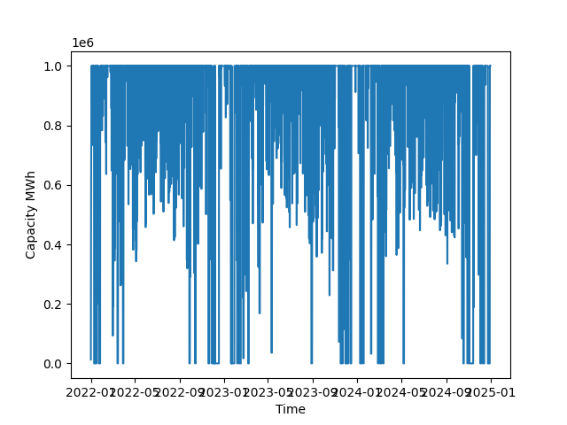
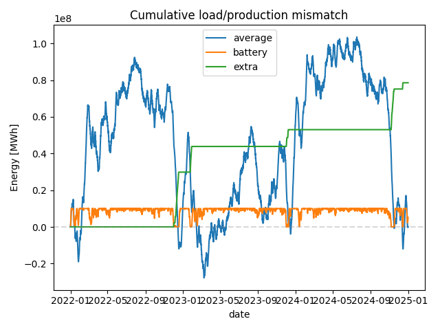

# GRID SIM

## Background

This code originates in my frustration with respect to the debate around the German energy transition and the lack of grounding in data of that discussion. I tried to answer two questions:

1) How much production capacity is required to produce enough energy to cover the annual electricity requirement?
2) How much storage capacity is required in order for that covering capacity to actually provide all instantaneous power?

## Results

There are no reliable results yet. For that we are lacking (conceptually) at least the spatial distribution and in particular the limitations from the transmission network. But also the code is in a very rough shape, so I would not even trust the results yet without doing manual order of magnitude verifications.

Nevertheless there are preliminary insights already:
1) Day-to-day variation in renewable output is significant (easily an order of magnitude for the extreme scenarios)
2) Battery capacity that covers electricity needs for a day (~1TWh) comes at a price point of 100 billion euros (@100 EUR/kWh)
3) Solar, wind and hydro currently produce about half of the total electric energy in Germany. A build out of at least a factor of two is required before the dynamic analysis here becomes relevant for the question "Is it sufficient?" (before that it's a simple "no")
4) 100 billion euros is not a prohibitive large sum.

	The German electricity market has an annual volume between 25 and 85 billion euros (@ 425 TWh/yr and 60-250 EUR/MWh).

	The required build out of wind and solar is in the same order of magnitude (100GW of each for about 100 billion euros each).

	Each of those should still come with reduced prices per installation (batteries and wind b/c they are still ramping up capacity, solar because average installation size increases).

The main question remains therefore: What is the required thermal capacity required to cover shortfalls at different battery build-out levels?


## Idea

We want to simulate the output of a future grid under realistic weather conditions. The first principles solution would be to take actual weather simulations put these in a renewable generation model and run the latter for different capacity installation levels.

This is in many ways beyond the scope of a free-time project (though someone really should do that!) therefore we are taking massive shortcuts:

1) We are basing everything on historic data and don't care about any large scale weather variations (e.g. more/less wind or more/less sun due to climate change)
2) From energy-charts.info we get both the history of installed production capacities and the actual power deliveries
3) We take download those and take the solar and wind data and scales each 15 minute interval up by the ratio of ```<capacity in our simulated grid> / <capacity installed at the historic time>```
4) We compare those power levels with the actual load (also provided by the  energy-charts data) and identify any shortfall or overproduction
5) The maximum shortfall defines the required (fossil) reserve capacity
6) We then add a simulated battery which accumulates excess production and discharges that to compensate shortfalls. Where the discharge method will be such, that it tries to minimize the required reserve capacity by scheduling the discharge taking future behavior into account (i.e. perfect weather prediction)

### Shortcomings

1) No spatial distribution taken into account
2) Production capacity levels are available only in limited temporal resolution, this will distort the results


## Implementation

The current state of this repository is maybe a week of work and most of the code is what I'd still consider unreliable.

The general idea (still subject to change) was to put the data handling (energy-charts API access, caching, historic data access) under `data`, the actual simulation code for the grid under `grid` and all analysis/visualization code under `utils`. Currently the executable is the `sim.py` in the top level.


## HowTo

If I didn't screw this up too much, then this should be a well behaved python project. I.e. you should just be able to do
```
	pip install -r requirements.txt
	python sim.py
```

which should generate the two plots below:



and



